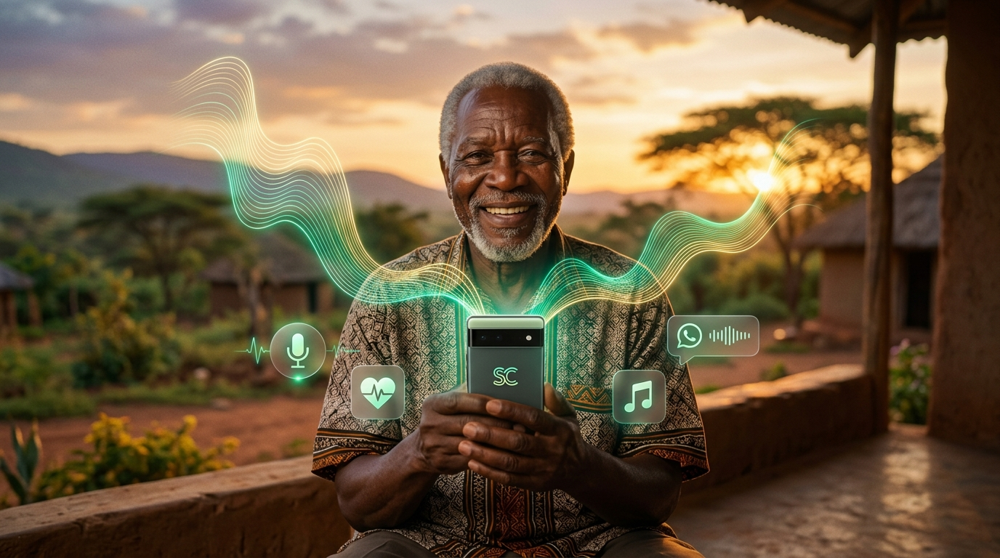

# 🎙️ SautiCare — Sauti ya Wazee (Pan-African Voice Navigator for Elders)

[](https://sauticare.onrender.com)
[](https://opensource.org/licenses/MIT)
[](https://www.assemblyai.com/)
[](#)
[](#)



🌐 **Live Application URL:** [https://sauticare.onrender.com](https://sauticare.onrender.com)  
📱 **PWA Installable:** Open in Chrome or Safari on mobile and tap *"Install"* or *"Add to Home Screen"*.

> **An oral-first voice navigator and lifeline for African elders using smartphones. Empowers seniors across Africa to navigate everyday smartphone apps (WhatsApp voice notes, YouTube gospel, Camera, phone settings), manage mobile money safely (M-Pesa, OPay, eWallet, Telebirr), and summon 24/7 emergency help—in 4 major African languages with offline resilience.**

Built for the **AssemblyAI - Voice Agent Hackathon** on [lablab.ai](https://lablab.ai/ai-hackathons/assemblyai-voice-agent-hackathon).

---

## 🌍 Supported African Regions & Languages

SautiCare bridges the digital literacy divide for over 100 million African elders across 4 key regional zones:

| Region | Primary Language & Dialect | Flag | Neural Voices Available | Supported Mobile Money & USSD |
| :--- | :--- | :---: | :--- | :--- |
| **East Africa** | **Kiswahili** (Kenya, Tanzania) | 🇰🇪 🇹🇿 | `Zuri`, `Rafiki`, `Daudi`, `Rehema` | M-Pesa (`*334#`), Safaricom (`*144#`) |
| **West Africa** | **Nigerian Pidgin** (Nigeria) | 🇳🇬 | `Ezinne`, `Abeo` | OPay / Transfers, MTN / Airtel (`*310#`) |
| **Southern Africa** | **isiZulu** (South Africa) | 🇿🇦 | `Thando`, `Themba` | eWallet, Vodacom / MTN (`*136#`) |
| **Horn of Africa** | **አማርኛ / Amharic** (Ethiopia) | 🇪🇹 | `Mekdes (መቅደስ)`, `Ameha (አመሃ)` | Telebirr (`*127#`), Ethio Telecom (`*804#`) |

---

## 🌍 The Problem in Africa

1. **Digital Exclusion of the Elderly:** Rapid smartphone adoption across Africa has flooded the market with affordable Android devices. However, digital literacy among aging parents and grandparents remains low. Complex nested menus, tiny English text, and unfamiliar icons create anxiety and fear.
2. **Oral-First Communication:** African elders overwhelmingly communicate through voice notes (e.g. WhatsApp audio) rather than typing text messages.
3. **Mobile Money Anxiety & Fraud:** Elders frequently rely on remittances from children in the city, but fear sending money to the wrong recipient or falling victim to scammers via complex USSD prompts (`*334#`, `*127#`).
4. **Alone During Emergencies:** In medical crises (falls, hypertension, sudden illness), elders often cannot unlock their phone or find contacts in time.
5. **The "Zero Bundle" Reality (Offline Need):** Cellular data bundles run out frequently or drop in rural areas. Emergencies and mobile money operations cannot rely solely on active 4G data.

---

## 💡 The SautiCare Solution

SautiCare solves these challenges through a **Hybrid Dual-Engine Architecture**:

* **🟢 Online Engine (Powered by AssemblyAI):**
  * Sub-second streaming Speech-to-Text over WebSockets and high-accuracy audio transcription.
  * Regional acoustic routing: Swahili (`sw`), Nigerian Pidgin (`en`), and multilingual detection for isiZulu (`zu`) and Amharic (`am`).
  * Culturally respectful personas (*Heshima kwa Wazee*) greeting elders properly in their native language (*"Shikamoo Mzee/Mama"*, *"Kedu / Salama Elder"*, *"Sawubona Mkhulu/Gogo"*, *"ጤና ይስጥልኝ አያቴ"*).
  * Automated tool calling for smartphone features, YouTube gospel streams, and emergency dispatch.

* **🟡 Offline Safety Fail-Safe (Zero Data / Rural Mode):**
  * When mobile internet is disconnected, SautiCare automatically switches to **Offline Safety Mode** via Service Worker v2.
  * **Emergency SOS:** Direct hardware trigger for **GSM voice dialing (`tel:`)** and **SMS with GPS coordinates** with 0MB data required.
  * **USSD Guide:** Guides elders step-by-step through offline USSD codes (`*334#`, `*310#`, `*136#`, `*804#`).

---

## 🏗️ Architecture

```
                    ┌──────────────────────────────────────────────┐
                    │     Elder-Friendly Smartphone Client         │
                    │  • Pan-African Language Tabs (4 Regions)     │
                    │  • 10 Neural Regional Voices (+40% Volume)   │
                    │  • High-Contrast AAA Font Zoom (A / A+)      │
                    │  • One-Touch "DHARURA (SOS)" Button          │
                    └───────────────────────┬──────────────────────┘
                                            │
                             [Network Connectivity Check]
                                   ┌────────┴────────┐
                (Online / Data OK) ▼                 ▼ (Offline / 0MB Data)
┌───────────────────────────────────────────┐    ┌───────────────────────────┐
│ Cloud Voice Engine (AssemblyAI)           │    │ Offline Safety Engine     │
│ • Sub-second Realtime Transcription       │    │ • Service Worker Cache v2 │
│ • Multilingual Acoustic Routing:          │    │ • Direct GSM Cellular SOS │
│   - Kiswahili (sw)                        │    │ • Direct GPS SMS Intent   │
│   - Nigerian Pidgin (en)                  │    │ • Offline USSD Guides:    │
│   - isiZulu / Amharic Detection           │    │   *334#, *310#, *136#     │
│ • Pan-African Intent Reasoner:            │    └───────────────────────────┘
│   - WhatsApp Voice Notes                  │                  │
│   - YouTube Gospel Music Streaming        │                  │
│   - Font Magnification & Camera           │                  │
│   - Mobile Money Verification (M-Pesa)    │                  │
│   - Emergency SOS Tool                    │                  │
└─────────────────────┬─────────────────────┘                  │
                      │                                        │
                      └──────────────────┬─────────────────────┘
                                         ▼
                     [10 Authentic Regional Neural Voices &
                         High-Contrast Visual Step Cards]
```

---

## 🎯 Demo Scenarios Across Africa

### 1. 🚨 Emergency Fall / Illness (Kiswahili 🇰🇪 🇹🇿)
* **User says:** *"Nisaidie, nimeanguka chini na siwezi kusimama"* (Help, I fell down and cannot stand)
* **Agent responds:** *"Tulia Mzee wangu, usijali. Nimeshatuma ujumbe wa dharura pamoja na mahali ulipo kwa mwanao Juma, na sasa ninapiga simu ya msaada mara moja."*
* **Action:** Dispatches emergency SMS with live GPS coordinates and initiates direct cellular phone call.

### 2. 💬 WhatsApp Voice Note (Nigerian Pidgin 🇳🇬)
* **User says:** *"I wan send voice note for WhatsApp"*
* **Agent responds:** *"Elder, to send WhatsApp voice note easy well well: Open the person chat, press and hold the green mic button for down right..."*
* **Action:** Shows step-by-step visual guidance card and direct deep-link to launch WhatsApp.

### 3. 🎵 Gospel Worship Music (isiZulu 🇿🇦)
* **User says:** *"Dlala umculo wokholo ku-YouTube"* (Play gospel music on YouTube)
* **Agent responds:** *"Sawubona Mkhulu! Ngikulisele izingoma ezinhle zokholo ku-YouTube..."*
* **Action:** Displays one-tap quick links to Zulu gospel playlists and opens YouTube directly.

### 4. 🔤 Screen Text Magnification (Amharic 🇪🇹)
* **User says:** *"የስክሪኑ ጽሑፍ በጣም አነሰ አግዝፈው"* (The screen text is too small, enlarge it)
* **Agent responds:** *"ጤና ይስጥልኝ አያቴ! የስክሪኑን ጽሑፍ መጠን ጨምሬዋለሁ..."*
* **Action:** Instantly enlarges entire app typography by +25% for easy reading without glasses.

---

## 🚀 Quickstart & Local Setup

### Prerequisites
* Python 3.10+
* Free AssemblyAI API Key ([Claim Hackathon Credits](https://www.assemblyai.com/dashboard/signup?utm_source=event&utm_medium=credit-grant&utm_campaign=lablab_virtual_hackathon))

### Installation
```bash
# Clone the repository
git clone https://github.com/ondinookello96/SautiCare.git
cd SautiCare

# Create and activate virtual environment
python -m venv .venv
# On Windows:
.\.venv\Scripts\activate
# On Linux/macOS:
source .venv/bin/activate

# Install dependencies
pip install -r requirements.txt

# Configure your API key
cp .env.example .env
# Edit .env and paste your ASSEMBLYAI_API_KEY
```

### Running the Application
```bash
python main.py
```
Open your browser at: **`http://localhost:8000`**

### Running the Tests
```bash
python -m unittest discover tests
```
*All 22 unit and integration tests pass synchronously.*

---

## 🏆 Hackathon Evaluation Alignment

| Judging Criteria (25% each) | How SautiCare Excels |
| :--- | :--- |
| **Application of Technology** | Deep integration of AssemblyAI Speech-to-Text streaming and audio transcription, regional acoustic routing, sub-second latency, and bidirectional WebSocket pipelines. |
| **Originality** | An oral-first voice assistant specifically engineered around the African elder digital divide, culturally grounded honorific personas (*Heshima kwa Wazee*), and code-switching. |
| **Business Value** | Solves a massive humanitarian, healthcare, and fintech inclusion problem for 100M+ aging Africans and their diaspora families. Natural B2B fit for telecom bundling (Safaricom, MTN, Airtel) and OEM pre-installs (Transsion / Tecno / itel). |
| **Presentation** | High-contrast elder-accessible UI, 10 authentic neural voices with +40% volume amplification, bilingual subtitles, and standalone PWA offline resilience. |

---

## 📄 License
This project is licensed under the **MIT License** - see the [LICENSE](LICENSE) file for details.
